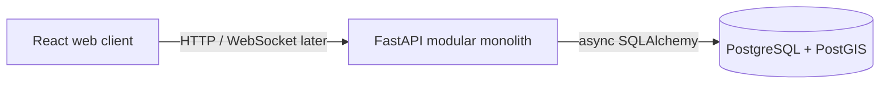

# RideFlow

RideFlow is a production-minded ride-sharing platform built as a modular monolith. Its purpose is to explore backend engineering, geospatial data, concurrency, real-time communication, event-driven architecture, and operational reliability without prematurely splitting the system into microservices.

This repository currently contains **Phase 1: Foundation**. Authentication and business domains are intentionally not implemented yet.

## Architecture



The browser, API, and database are separate runtime containers. The backend is one deployable application whose future `auth`, `drivers`, `rides`, and `payments` modules will own their business rules behind internal boundaries.

See [docs/architecture.md](docs/architecture.md) for the detailed shape and [docs/decisions](docs/decisions) for architectural decisions.

## Technology stack

- Backend: Python 3.12, FastAPI, Pydantic Settings, SQLAlchemy 2 (async), Alembic
- Database: PostgreSQL 16 with PostGIS 3.4
- Frontend: React 19, TypeScript, Vite, Ant Design, React Router, TanStack Query
- Tooling: Docker Compose, Pytest, Ruff, mypy, ESLint, Vitest, GitHub Actions

Redis, Kafka, WebSockets, Prometheus, Grafana, and OpenTelemetry are deliberately deferred until the phases that need them.

## Quick start

Requirements: Docker with Compose support.

```bash
cp .env.example .env
docker compose up --build
```

The backend runs migrations before it starts. Open:

- Web client: <http://localhost:5173>
- OpenAPI UI: <http://localhost:8000/docs>
- Liveness: <http://localhost:8000/health>
- Readiness: <http://localhost:8000/ready>

Stop the stack with `docker compose down`. Add `--volumes` only when you intentionally want to remove local database data.

## Environment configuration

Configuration uses `RIDEFLOW_`-prefixed environment variables. `.env.example` documents all Phase 1 values. Local defaults are development-only; use externally managed secrets and a strong database password outside local development.

`RIDEFLOW_CORS_ORIGINS` is a JSON list, for example:

```text
RIDEFLOW_CORS_ORIGINS=["https://app.example.com"]
```

## Database migrations

Run migrations against the Compose database:

```bash
docker compose run --rm backend alembic upgrade head
```

Create a revision after adding models:

```bash
docker compose run --rm backend alembic revision --autogenerate -m "describe change"
```

Review autogenerated migrations before applying them. Phase 1's first migration enables PostGIS.

## Verification

Run every check in containers:

```bash
make verify
```

Or run suites independently with `make backend-test`, `make backend-check`, `make frontend-test`, and `make frontend-check`.

## API and realtime documentation

FastAPI generates OpenAPI documentation at `/docs` and `/openapi.json`. The hand-maintained API contract and health semantics live in [docs/api.md](docs/api.md).

WebSockets and Kafka are not present in Phase 1. Their intended boundaries and adoption criteria are recorded in [docs/architecture.md](docs/architecture.md) and [docs/events.md](docs/events.md); concrete schemas will be added alongside their implementations.

## Roadmap

1. **Foundation (current):** monorepo, FastAPI, React, PostGIS, migrations, containers, health checks
2. Authentication: users, roles, JWT access/refresh tokens, profiles
3. Drivers and vehicles: profile, availability, vehicle, PostGIS location
4. Ride lifecycle: state machine, estimates, ride operations
5. Matching: proximity search, reservation, Redis concurrency protection
6. Real-time tracking: WebSockets and location streaming
7. Payments and ratings: provider abstraction and idempotency
8. Kafka events
9. Reliability patterns and transactional outbox
10. Observability
11. Load and failure testing
12. Evidence-driven service extraction, if warranted

