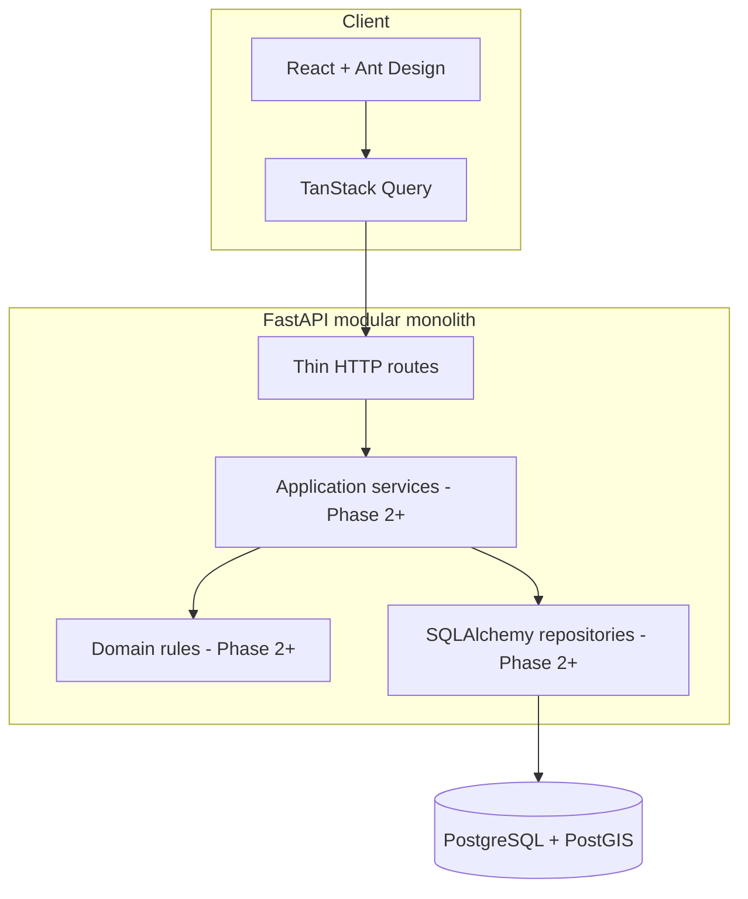

# Architecture

## Current context

RideFlow begins as a modular monolith: one backend process and one relational source of truth. This makes transactions and local development straightforward while module boundaries preserve an extraction path if scaling or ownership later justifies it.

## Repository boundaries

- `backend/app/api`: transport concerns and versioned routes
- `backend/app/core`: configuration and future cross-cutting infrastructure
- `backend/app/database`: engine, sessions, metadata, and common persistence primitives
- `backend/migrations`: the only supported mechanism for schema evolution
- `frontend/src/api`: typed browser-to-API calls
- `frontend/src/app`: composition, providers, and routing
- `frontend/src/pages` and `components`: presentation

Domain modules will be added when their phase begins. They should contain services and rules rather than pushing behavior into route handlers.

## Runtime and health semantics

`GET /health` is a liveness probe and performs no dependency I/O. `GET /ready` executes a minimal database query and returns 503 when PostgreSQL is unavailable. This distinction prevents a database incident from causing an orchestrator to endlessly restart an otherwise healthy API process.

The API uses an async engine with connection pre-ping. Sessions are request-scoped and do not auto-commit; future services must make transaction boundaries explicit.

## Deferred infrastructure

- Redis arrives with matching, where atomic driver reservations and short-lived location data provide a concrete reason for it.
- WebSockets arrive with real-time tracking and will call application services rather than contain business rules.
- Kafka arrives after core workflows work synchronously. Event envelopes, idempotent consumers, and eventually an outbox will be implemented together.
- Metrics and tracing arrive in the observability phase after meaningful workflows exist to instrument.

## Security baseline

Settings are environment-driven, CORS origins are explicit, containers contain no secrets, and `.env` is ignored. Authentication, request correlation, structured safe logging, and rate limiting are Phase 2 or later concerns and must not be treated as already present.

