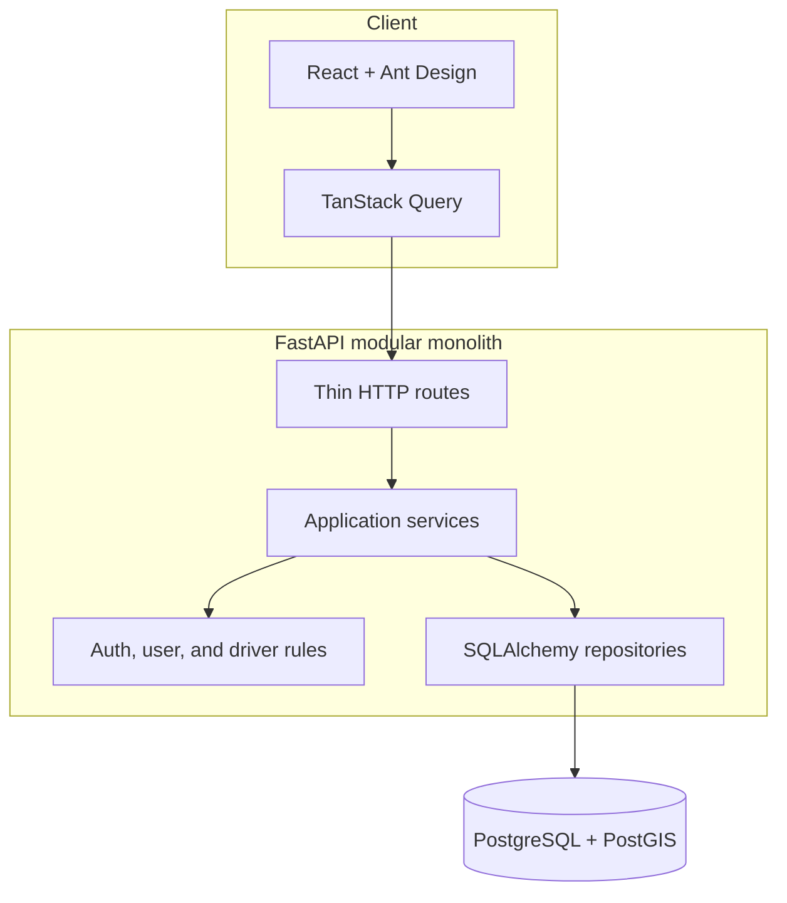
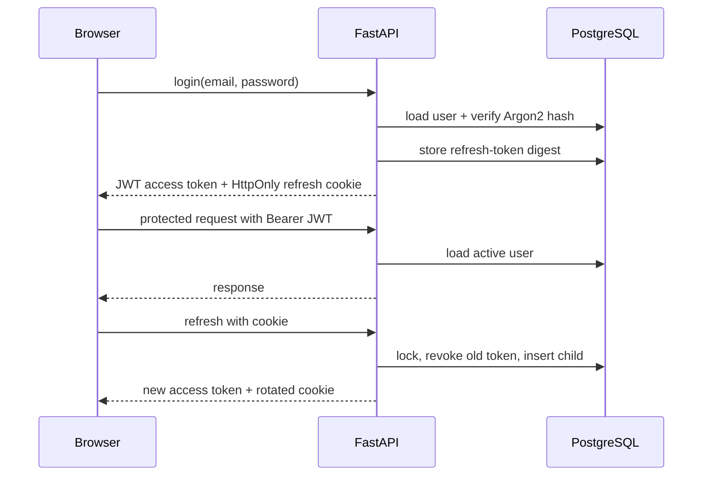
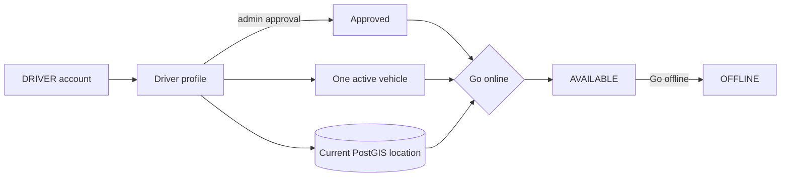

# Architecture

## Current context

RideFlow begins as a modular monolith: one backend process and one relational source of truth. This makes transactions and local development straightforward while module boundaries preserve an extraction path if scaling or ownership later justifies it.

## Repository boundaries

- `backend/app/api`: transport concerns and versioned routes
- `backend/app/core`: configuration and future cross-cutting infrastructure
- `backend/app/database`: engine, sessions, metadata, and common persistence primitives
- `backend/migrations`: the only supported mechanism for schema evolution
- `frontend/src/api`: typed browser-to-API calls
- `frontend/src/app`: composition, providers, and routing
- `frontend/src/pages` and `components`: presentation

The `users`, `auth`, and `drivers` domains demonstrate the module pattern: HTTP routes parse and serialize, services own transactions, repositories own queries, and models/schemas define persistence and contracts. Later domains should follow this boundary without adding abstraction that has no concrete use.

## Runtime and health semantics

`GET /health` is a liveness probe and performs no dependency I/O. `GET /ready` executes a minimal database query and returns 503 when PostgreSQL is unavailable. This distinction prevents a database incident from causing an orchestrator to endlessly restart an otherwise healthy API process.

The API uses an async engine with connection pre-ping. Sessions are request-scoped and do not auto-commit; future services must make transaction boundaries explicit.

## Deferred infrastructure

- Redis arrives with matching, where atomic driver reservations and short-lived location data provide a concrete reason for it.
- WebSockets arrive with real-time tracking and will call application services rather than contain business rules.
- Kafka arrives after core workflows work synchronously. Event envelopes, idempotent consumers, and eventually an outbox will be implemented together.
- Metrics and tracing arrive in the observability phase after meaningful workflows exist to instrument.

## Authentication flow

The backend does not trust the JWT role claim for authorization; it reloads the active user, so deactivation and role changes take effect immediately. Public clients cannot register administrators. Production startup rejects the development JWT secret. Expected errors use a stable envelope without stack traces.

The browser holds access tokens only in memory. Refresh tokens are stored in `HttpOnly`, `SameSite=Lax` cookies and as SHA-256 digests in PostgreSQL. Non-browser clients may use the refresh token from the response body.

Rate limiting, structured request correlation, and security-event audit logs remain future reliability/observability work. A distributed rate limiter should arrive with Redis rather than using a misleading process-local counter.

## Driver availability and location

The API exchanges coordinates as latitude and longitude. Persistence constructs WGS84 points in the spatial convention `POINT(longitude latitude)`. A GiST index supports `ST_DWithin` candidate filtering, while `ST_Distance` produces metre-based ordering because the column uses `geography`.

Vehicle activation and availability changes lock the driver-profile row, serializing competing changes for one driver. A partial unique index is the final safeguard that only one vehicle can be active. Location publication uses PostgreSQL `ON CONFLICT DO UPDATE`, so the single current-location row is replaced atomically.

The nearby-driver repository is intentionally internal until Phase 5 supplies ride matching and driver reservation. PostgreSQL is the source of truth in Phase 3; Redis is not introduced merely as a second location store.
